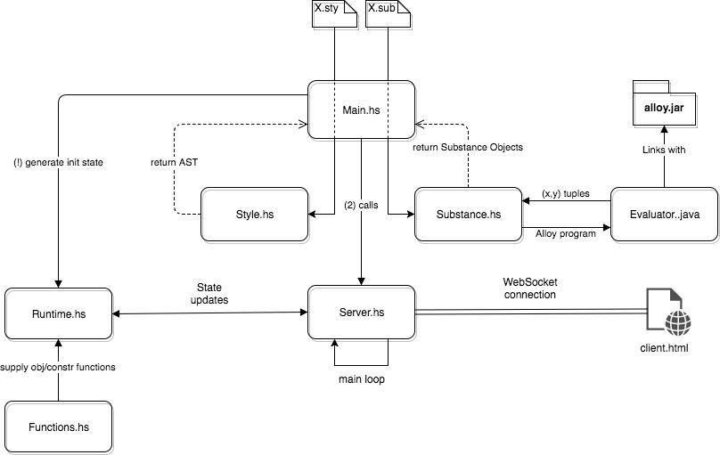

# Penrose Summer 2017 Ramp-down document

This document records the status of Penrose after Nimo's REU program in summer 2017, and provides some ideas about what to do next.

## Overview

- We will refer to the project root directory as "TOP" in this document

## Dependencies

- The fastest way to get the dependencies right is to `cabal install`, because all dependencies are specified in `TOP/penrose.cabal`. You can always inspect the file manually to see specific requirements.
- For Alloy support, you will need a JRE. Here is my version:
```
java version "1.8.0_25"
Java(TM) SE Runtime Environment (build 1.8.0_25-b17)
Java HotSpot(TM) 64-Bit Server VM (build 25.25-b02, mixed mode)
```

## Building the project

- There are three ways to build the Haskell project:
    - `ghc Main` in `TOP/src`. As usual, it creates all temp files in the current directory
    - `cabal build` in TOP, which will build the binary at `TOP/dist/build/penrose`
        - Feel free to add that build directory in your `$PATH`
        - You can also build the project in arbitrary directories by add the `--builddir=<target-dir>`
    - `cabal install` in TOP, which will build the binary at `TOP/.cabal-sandbox/bin`
        - This install normally happens in a sandbox. You can simply execute `cabal sandbox init` in TOP the first time you clone the project from GitHub. It will take quite a while to build for the first time.
        - cabal seems to have problem resolving the dependencies sometimes. Try prepending `sudo`, and adding the flag `--reorder-goals` if there is any bizarre problem.
        - For some reason, the binary built this way tends to run faster. I didn't look into the cause, which might be some default optimization by cabal
- If you are running Penrose on instances that requires Alloy support, you will also need to build the file `Evaluator.java`. You can do so by executing `make` in `TOP/src`.
- In the future, if we include more libraries in our project, `penrose.cabal` needs to be updated accordingly. `cabal gen-bounds` will automatically generate upper/lower bounds of newly linked packages.
- You can also `make clean` to clean up `TOP/src`, removing all intermediate files are temp files such as `__temp__.als` (byproduct of integration with Alloy).


## Running the project

- Here are some usable examples in the code base:
    - Deep nested sets: `nested.sub` and `venn.sty`
        - Any general set programs with `venn.sty`/`tree.sty` would work.
            - For example: `twosets.sub` and `venn.sty`
    - Surjection with randomized instances: `surjection-demo.sub` and `surjection-demo.sty`
    - composition of functions: `composition.sub` and `composition.sty`
    - two visualizations of sets: `tree.sub` and `tree.sty`/`venn.sty`
    - continuous map: `continuousmap.sub` and `continuousmap.sty`

## Documentation

- The documentation of Penrose is generated using Haddock, a tool similar to Javadoc. Find the grammar of the markup language [here](http://haskell-haddock.readthedocs.io/en/latest/markup.html)
- An HTML documentation site can be generated using:
```
cabal haddock --hyperlink-source --executables  --html-location='http://hackage.haskell.org/package/penrose/docs'  --haddock-options=--no-print-missing-docs
```
- By default, all top-level functions will appear in the documentation page. Adding `{-# OPTIONS_HADDOCK prune #-}` will hide undocumented ones and only show documented ones.

## Structure of the project

- Here is a diagram of the overall structure of the project: 
- The project is now divided into modules. When you are working on a particular module, for example, you can just compile that module using `ghc <module-name>`.

## Known problems

- Don't panic if there is some parsing error when you run one of the \*jection examples. Alloy sometimes returns __an empty function__, which I pretty much disregarded and let it failed.


- (below are notes for myself)
- TODO: make specified sets working with non-specified ones
- TODO: make the dot operator working

## Next semester...
